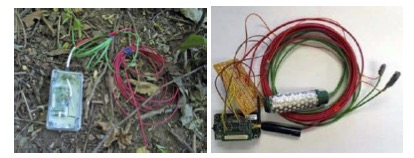
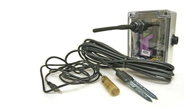
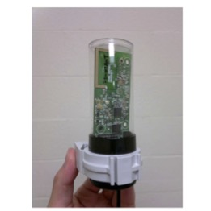

# Life Under Your Feet

Our paper titled *Wireless Sensor Network for in situ Soil Moisture Monitoring* received the 
best paper award at the [Sensornets 2021](http://sensornets.org) conference this past week. 

The paper summarizes our **Life Under Your Feet** project that developed three generations of sensing hardware and software, and 
deployed wireless sensing networks in various habitats including tropical and temperate forests, agricultural fields and a desert. 

In the next few paragraphs I summarize our efforts and experiences with Life Under Your Feet. For more, read the full paper.  

## Three generations of sensing platforms 

We deployed three generations of wireless sensing nodes (also known as motes) starting in 2005. 

Our first WSN platform, based on the MicaZ in Hammond boxes.
The first motes were manufactured by CrossBow Inc. These MicaZ mote contained processing, storage, and communication 
capabilities in a small form factor (matchstick box size). Besides two simple on-board sensors for temperature and light, 
five additional external analog sensors could be connected simultaneously to the mote via a separate fan-out board. 
In practice, this board turned out to be very fragile and was one of the reasons we abandoned this platform. However, 
the MicaZ motes were quite expensive (~$200 at that time). 

In 2007 we switched to a new mote, the Tmote Sky from MoteIV. This platform offered four times the measurement 
fidelity and twice as much space for storing samples. We designed and built an expansion board that allowed us 
to handle four external analog sensors. 

In 2013 we designed and started deploying our third generation sensing platform, the Breakfast Suite, 
consisting of the Bacon mote and the Toast multiplexer module. These were all designed in house and manufactured 
by an OEM in Hungary. This new mote encapsulates our experiences and is specifically designed for soil monitoring 
at different scales. With the same form factor as the Tmote Sky, the Bacon mote has five times the processing power 
and eight times the storage space. Moreover, its average power consumption is an order of magnitude lower than 
the Tmote sky and the manufacturing cost for thousands of units was only $20, in 2012. 

## People
Jianing Fang, Chuheng Hu, Nour Smaoui, Doug Carlson, Jayant Gupchup, Razvan Musaloiu-E., 
Chieh-Jan Mike Liang, Marcus Chang, Omprakash Gnawali, Tamas Budavari, Andreas Terzis, 
Katalin Szlavecz, and Alexander S. Szalay 

## Acknowledgements

I want to personally thank [Alex Szalay] and Kalalin Szlavecz for starting and leading the project for the 
last 15 years. The Life Under Your Feet project started out with seed grants from Microsoft Research and 
the Seaver Institute. We are most grateful to Jim Gray who was instrumental in getting this project off the 
ground, and to Dan Fay and Tony Hey for their continuing support and encouragement. Later this project was 
partially supported by several grants from the National Science Foundation 
(NSF IDBR-0754782 and NSF DEB-0423476, NSF-ERC EEC-0540832). The Gordon and Betty Moore Foundation 
sponsored the development of the Breakfast Suite. Undergraduates Josh Cogan, Julia Klofas and 
Justin Silverman helped building and testing the WSN. Mike Liang contributed to the software 
development; Jordan Raddick, Taesung Kim and Luis Grimaldo were instrumental in developing Grazor. 
Thanks are due to the Maryland Department of Natural Resources for allowing us to use their site as 
testbed, and to John Hom of the US Forest Service for hosting the gateway computer in his lab at Cub Hill. 
