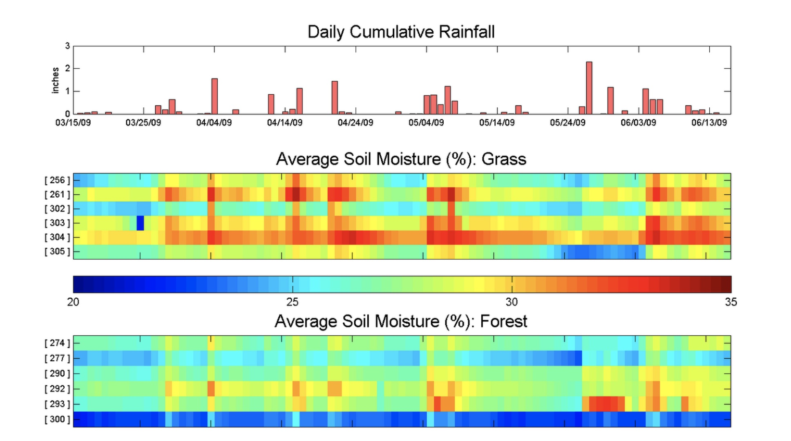

# Life Under Your Feet

The **Life Under Your Feet** project is a long-term science and engineering project, centered at the Johns Hopkins University. 
It has developed multiple generations of remote sensing hardware and software for soil science and deployed wireless 
sensing networks in various habitats including tropical and temperate forests, agricultural fields and a desert. 

In the next few paragraphs I summarize our efforts and experiences with Life Under Your Feet. For more, 
you can read our [paper](luyf-sensornets.pdf) which received the best paper award at [SensorNets 2021](http://www.sensornets.org/PreviousAwards.aspx#2021).  

## Soil Science

Soil is a semi-aquatic habitat harboring a huge diversity of terrestrial as well as aquatic organisms. 
The amount and availability of soil water affect survival and activity of organisms from bacteria to macrofauna 
and to plants directly, but also indirectly, by redistributing nutrients or toxic substances. Consequently **soil water content is 
a main driver of belowground biological activity**. Pathways and rates of complex biogeochemical processes can shift 
dramatically especially if the soil dries out or becomes waterlogged. For instance the same ecosystem can 
switch between being a methane sink or source depending on fluctuations of water table or precipitation patterns.

Soil is inherently **spatially heterogeneous** in all three dimensions and at many spatial scales.
Soil physical, chemical and biological characteristics vary even more in fragmented landscapes. 
An extreme example of this is the urban-suburban environment with highly modified surface topography 
and soil conditions.

For soil ecology research, **understanding soil moisture conditions on a field scale is 
paramount** to identify biogeochemical activity *hot spots* and *hot moments*, and to explain 
spatial distribution of soil organisms. Spatially explicit approach to study soil communities is 
relatively new, but increasingly recognized as a significant tool in explaining high soil biodiversity.
One approach to **collect in situ, spatially explicit, continuous soil data is to use sensor systems**, 
more specifically wireless sensor networks (WSN hereafter). Since originally complete **off-the 
shelf solutions were not available**, and both the sensors themselves and the related data systems 
needed customization, we, a group of soil ecologists, physicists and computer scientists, **started building our own WSN** 
to monitor the soil ecosystem.

## Three generations of sensing platforms 

We deployed three generations of wireless sensing nodes (also known as *motes*) starting in 2005. 

### First generation

The first generation sensor platform was based on the [MoteZ](http://www.nr2.ufpr.br/~adc/documentos/micaz_datasheet.pdf) 
mote from CrossBow Inc. These motes contained processing, storage, and communication capabilities in a small form factor 
(matchstick box size). Besides two simple on-board sensors for temperature and light, 
five additional external analog sensors could be connected simultaneously to the mote via a separate fan-out board. 
We built our own temperature sensors placing thermistors into small plastic vials. For soil moisture we first 
experimented with the Watermark moisture sensor by Irrometer. In practice the performance of these sensors rapidly degraded
with time and so we switched to the ECH20 EC-5 moisture sensor by Decagon. 

We placed the motes in IP67-rated enclosures but we found that prolonged exposure to the changing weather conditions, holes that 
drilled for the sensor cables (albeited sealed), and multiple rounds of servicing the motes to replace batteries, compromised
their water protection properties. The fanout board turned out to be very fragile and was one of the reasons we abandoned 
this platform. Moreover, the MicaZ motes were quite expensive (~$200 at that time). 

### Second generation

In 2007 we switched to a new mote, the [Tmote Sky](http://www.snm.ethz.ch/snmwiki/Projects/TmoteSky.html) from MoteIV
while keeping the custom-built temperature and Decagon moisture sensors. 
This platform offered four times the measurement fidelity and twice as much space for storing samples. 
We designed and built an expansion board that allowed us to handle four external analog sensors. We switched from
AA batteries to a single D-sized Li-SoCl2 battery that increased lifetime by an order of magnitude. 

### Third generation

In 2013 we designed and started deploying our third generation sensing platform, the **Breakfast Suite**, 
consisting of the **Bacon mote** and the **Toast multiplexer module** capable of reading eight external
sensors at a time. These were all designed in house and manufactured 
by an OEM in Hungary. This new mote encapsulated our experiences and is specifically designed for soil monitoring 
at different scales. With the same form factor as the Tmote Sky, the Bacon mote has five times the processing power 
and eight times the storage space. We switched from a 802.15.4 radio operating in 2.4GHz to a 900 MHz radio due to its
better signal propagation properties.  Moreover, the average power consumption of then Gen-3 mote
is an order of magnitude lower than the Tmote sky and the manufacturing cost for thousands of units was 
only $20, in 2012. 

## Deployments

Roughly parallel to the evolution of hardware platforms over the years, our deployment architecture 
went through several changes as we identified weak points and expanded our usage scenarios. 
At a high level, we first increased reliability by adding a permanently-powered *basestation* collection 
mote (with Internet access), then worked to maintain reliability while decoupling 
network performance from the presence of the basestation.

### Early deployments

The early deployments had no persistent infrastructure: motes logged data internally and required 
a field visit to collect their data over a wireless connection to a laptop. While this approach was more 
convenient than using wired data loggers, it was still a tedious manual process. More importantly, due 
to the lack of a reliable clock on the motes, periodic references to some external time source were 
required to map measurements to points in time since motes would reboot and stay off for random time
intervals. 

The first deployment occurred on the Johns Hopkins University campus in a wooded area and lasted 
for seven months. Subsequent deployment took place in urban forests in Baltimore (Leakin park, Cub Hill), 
deciduous forests in the Mid-Atlantic Coastal Plains (Smithsonian Environmental Research Center, SERC, Jug Bay), 
agricultural fields (USDA), tropical rainforests (Ecuador), and high altitude deserts (Atacama). 

### Cub Hill

The largest and longest deployment was in an urban residential area, called Cub Hill,
in Parkville, Baltimore County, MD.

The majority of motes were deployed in the two main land cover types, forest and grass. 
At each sampling location soil temperature and soil moisture were measured at two depths. 
In its largest configuration the network collected 106 soild moisture samples every 10 minutes.

The Cub Hill experiment exemplifies our second generation of deployments. These added a persistent basestation mote 
(attached to an Internet-connected PC) that could automatically download data periodically and 
transfer it to a database. These deployments also used the [Koala](http://www.cs.jhu.edu/~razvanm/ipsn2008koala.pdf)
low power collection protocol to enable multi-hop downloads (where the network cooperates to relay 
data for motes which are out of the communication range of the basestation). While regular contacts 
with the basestation helped to obviate the need for a reliable on-board clock, there were still 
a few periods during which power outages at the deployment site, heavy snow, or 
general poor network conditions led to timestamp losses.

### Smithsonian Environmental Research Center. 

The third hardware+software architecture decoupled the energy requirements of individual motes 
from the overall network size by segmenting deployments into semi-autonomous patches. 
This multi-tiered network approach is a critical step towards enabling large-scale 
deployments. Our largest Gen-3 deployment was at the [Smithsonian Environmental 
Research Center](https://serc.si.edu/) in Edgewater, Maryland. The pilot lasted five months. 
We deployed two mote patches in two forest types each. Each patch was equipped with three sensor 
assemblies, collecting data from 24 sensors. We deployed two more patches randomly in the forest 
to collect background data. Over the course of five months we collected over 90,000 data points.

## Lessons learned

The Life Under Your Feet project has collected over 400MB of raw sensor data, 
approximately 20% which were soil moisture data. The Cub Hill deployment itself 
collected 100,745,909 samples, out of which 39,471,983 and 17,627,640 
were environmental and specifically soil moisture data, respectively. 

### Data yields and mote lifetime

The figure above shows how the number of operational nodes and total data yield (timestamped and fault-free data) 
varied over an 18-month maintenance-free period. All nodes were installed with fresh batteries at the 
end of June 2010 and were not serviced again. While the yield declined slowly as devices failed, the 
remaining nodes continued to work well even as the network degraded around them. It's not until November of 2011 that 
so few nodes remain in operation that it became difficult to reach them and obtain time references for them.

The figure above shows the distribution of maintenance intervals on our system. While a handful of devices 
fail within the first few months (likely due to physical/moisture damage), 90% of the nodes ran 
for more than 6 months without maintenance, and 77% ran for over a year without maintenance. With 
regular twice-yearly site visits, such a deployment could be expected to continuously deliver 90%+ yields.

### Causes of mote failure

We evaluated mote failure according to the underlying causes. Software defects caused 11% of the mote 
failures. About half of the failures were due to low batteries or moisture in their enclosures (43% and 9%, respectively). 
The rest were marked as "unknown", because they showed neither low battery nor high moisture 
before their disappearance. These could be nodes with a catastrophic leak during a rain
event, nodes that froze and drained their battery in one shot, nodes that suffered physical damage 
(such as a falling tree or animal chewing), or nodes that failed for no apparent reason. 
Given that the deployment was in an urban environment, surprisingly, no motes were stolen or vandalized.

## Soil moisture results

The figure illustrates local variation of soil moisture at two land cover types in the Cub Hill residential 
neighborhood in Baltimore County, MD, between March and June 2009. A subset of locations are shown. 
Each cell represents daily average values at 10 cm depth. Daily precipitation values are also shown.

The primary objective of the Life Under Your Feet project was to design and build WSNs 
for monitoring the soil ecosystem and to test the system in a variety of environmental conditions. 
Similar efforts have been reported (see full paper for references), or still 
ongoing (http://soilscape.eecs.umich.edu/). To our knowledge, at the time of the deployment, the 
Cub Hill project was the largest and it was the longest experiment of its size. 
In general, our deployments met their key goals: they survived for long periods in the field, while 
reliably collecting large volumes of data. The data can be utilized for a variety of projects 
from building hydrology models to identifying biological activity hotspots.

## People
Jianing Fang, Chuheng Hu, Nour Smaoui, Doug Carlson, Jayant Gupchup, Razvan Musaloiu-E., 
Chieh-Jan Mike Liang, Marcus Chang, Omprakash Gnawali, Tamas Budavari, Andreas Terzis, 
Katalin Szlavecz, and Alexander S. Szalay 

## Acknowledgements

I want to personally thank [Alex Szalay](http://www.sdss.jhu.edu/~szalay/) and 
[Kalalin Szlavecz](https://eps.jhu.edu/directory/katalin-szlavecz/) for their scientific, technical, and organizational
leadership of Life Under Your Feet during the last 15 years. 

Big thanks to Jianing and Chuheng for reviving the project and leading its fourth generation. 

The Life Under Your Feet project started out with seed grants from Microsoft Research and 
the Seaver Institute. We are most grateful to Jim Gray who was instrumental in getting this project off the 
ground, and to Dan Fay and Tony Hey for their continuing support and encouragement. Later this project was 
partially supported by several grants from the National Science Foundation 
(NSF IDBR-0754782 and NSF DEB-0423476, NSF-ERC EEC-0540832). The Gordon and Betty Moore Foundation 
sponsored the development of the Breakfast Suite. Undergraduates Josh Cogan, Julia Klofas and 
Justin Silverman helped building and testing the WSN. Mike Liang contributed to the software 
development; Jordan Raddick, Taesung Kim and Luis Grimaldo were instrumental in developing Grazor. 
Thanks are due to the Maryland Department of Natural Resources for allowing us to use their site as 
testbed, and to John Hom of the US Forest Service for hosting the gateway computer in his lab at Cub Hill. 
